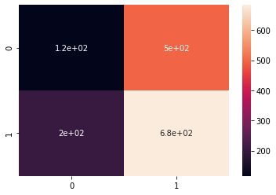

# MSDS19040_COVID19_DLSpring2020

Fine tuned deep learning Experiments on COVID DataSet using state of the art NN architecture ResNet-18 and VGG-16 with and without focal loss 

Covid Images Dataset:

#### ResNet 18:
##### Load pretrained CNN model and fine-tune FC Layers

##### Fine-tune the CNN and FC layers of the network

#### VGG 16:
##### Load pretrained CNN model and fine-tune FC Layers

##### Fine-tune the CNN and FC layers of the network

## Detailed Analysis

### TASK - 1: Load pretrained CNN model and fine-tune FC Layers 

We are going to train and test out two state of the art CNN models ResNet18 and VGG16 on COVID-19 dataset. These models are previously trained on ImageNet. 

In first task we changed our FC layer of both networks with our own defined two FC layers with following details  

T1_ResNet18_Modules.extend([nn.Linear(25088, (40 * 10) + 100)]) 

T1_ResNet18_Modules.extend([nn.Linear((40 * 10) + 100, len(class_names))]) 

25088 are output of T1_VGG16_Model.classifier[6].in_features, then output is (Last 2 Digits of Roll Number * 10) + 100 similarly in  second FC layer we have same input as we have output of previous layer and final output of 2 as we have only binary classes here. Our dataset contains binary classes “Classes: ['infected', 'normal']” 

 

 

COVID-19 Dataset: 

  

 

 

RESNET-18: 

ResNe18 is one of the types of CNN, I have trained this model on COVID dataset in first epoch we have following results related to loss as we have loss between 0.25 to 2.00 but mostly it lies between 0.25 to 0.75 

For this experiment my learning rate was 0.01 for this learning rate my accuracy and loss were very high, so I change it to 0.001 [Learning Rate: 0.001] [Batch Size: 20]  

 

1st Epoch  

 

2nd Epoch  

 

 

3rd Epoch  

 

 

10th Epoch  

 

 

Loss Curve: 

Little bump in 9th epoch overall it gradually decreasing.  

 

Accuracy:  

After training my dataset on 10 epoch I run it on Test dataset with is around 1500 images, I have accuracy of 94%. One of the major reasons is I trained my model multiple times on training dataset. 96% accuracy is best from my three accuracies like first time my accuracy result was 77% then 81% then 94% 

 

 

On validation dataset we also have 1500 unseen images, by running out model on that unseen dataset out accuracy is about   

 

Confusion Matrix of Test Dataset: 

0: Infected 

1: Normal  

tensor([[566., 49.], [ 56., 829.]]) 

  

Confusion Matrix of Validation Dataset: 

0: Infected 

1: Normal 

tensor([[546., 69.], [102., 783.]]) 

 

 

VGG-16:  

Similarly, for VGG16 I used trained on ImageNet model and train on CONVID dataset. VGG16 is another type of CNN, I have trained this model on COVID dataset in first epoch we have following results related to loss as we have loss between 0.25 to 2.00 but mostly it lies between 0.25 to 0.75 

For this experiment there was interesting fact my Batch Size was 8 and Learning Rate was 0.01, Momentum was 0.9, by executing this VGG16 my loss was very high and at some time it goes to NAN value. 

I have used following as VGG16 with two FC layers 

(classifier): Sequential(  

(0): Linear(in_features=25088, out_features=4096, bias=True)  

(1): ReLU(inplace=True)  

(2): Dropout(p=0.5, inplace=False)  

(3): Linear(in_features=4096, out_features=4096, bias=True)  

(4): ReLU(inplace=True) (5): Dropout(p=0.5, inplace=False)  

(6): Linear(in_features=4096, out_features=500, bias=True)  

(7): Linear(in_features=500, out_features=2, bias=True)  

)  

 

Following results was based on Batch Size was 20 and Learning Rate was 0.001, Momentum was 0.9. It is showing loss between 0 to 1.2. Here I found something weird that in every loss graph I found a huge jump on same point. 

 

 

1st Epoch  

 

 

 

2nd Epoch  

 

 

3rd Epoch  

 

4th Epoch 

 

Inserting image... 

9th Epoch  

Inserting image... 

10th Epoch  

Loss Curve: 

  

 

Accuracy:  

By training on COVID dataset I start testing on test records its Accuracy is little high like in first experiment accuracy was 41%, Now it's become around 51% 

 

Similarly, on Validation dataset this model shows the accuracy around 54%  

  

 

Confusion Matrix of Test Dataset: 

0: Infected 

1: Normal 

tensor ([[116., 499.], [202., 683.]]) 

 

 

Confusion Matrix of Validation Dataset: 

0: Infected 

1: Normal 

tensor ([[133., 482.], [212., 673.]]) 

 

 

### TASK - 2: Fine-tune the CNN and FC layers of the network 

For this task I have unfreeze all layers and then train on CONVID dataset, then freeze few and train dataset   

RESNET-18:  

In this task I have unfreeze all layers and train, first time it took 1 hour 28 minutes to train only for 1st Epoch.  

I have trained my model many times some time it prints Loss curve as first it shows loss at 8 or 9 then suddenly came down to 1.5 or 2 and remains in limit of 0 to 2. This report contains images of second last experiement and my code file result contains latest results.  

 Train Epoch: 0 [11980/12000 (100%)] Loss: 0.364946: 600it [1:28:30, 8.85s/it] 

 

 

1st Epoch  

 

2nd Epoch  

Inserting image... 

3rd Epoch 

 Inserting image... 

4th Epoch 

And so, on   

 

 

Loss Curve: 

Experiment on 10 epochs, it was going down from 1 to 7 then for 8th epoch it goes a little up then on 10th epoch it again comes to 0.1’s lane  

  

Predicted Accuracy: 

Predicted: normal normal infected infected normal normal normal normal normal infected infected infected infected normal infected normal infected normal normal infected  

Ground Truth: normal normal infected infected normal normal normal normal normal infected infected infected infected normal infected normal infected normal normal infected  

Accuracy on test dataset is better as shown below its around 95%  

 

But for validation data its accuracy is little down as shown below 

  

 

Confusion Matrix of Test Dataset: 

0: Infected 

1: Normal 

tensor([[547., 68.], [ 67., 818.]]) 

 

 

 

 

 

Confusion Matrix of Validation Dataset: 

0: Infected 

1: Normal 

tensor([[542., 73.], [ 68., 817.]]) 

 

 

VGG-16: 

In this task I have unfreeze all layers and train, for VGG016 if I train model on few epochs like 1 or 2 it is showing very low accuracy like 30% etc. And if I run on 10 Epoch it’s shows some better results like 50% to 60%   

As seen in below loss graph of epoch it fluctuating between 0.2 to 0.8  

 

1st Epoch 

  

2nd Epoch 

 

3rd Epoch 

 

10th Epoch  

Loss Curve: 

Again doing with 5 epoch its showing following Loss Curve  

 

 

 

 

  

Predicted vs Ground Truth: 

Predicted: normal normal normal infected infected normal infected infected normal normal normal normal normal normal normal infected normal normal infected normal  

Ground Truth: normal normal normal infected infected normal infected infected normal normal normal normal normal normal normal infected normal normal infected normal  

For Test data its showing accuracy as follow  

  

For Validation date its little low than test dataset  

  

Confusion Matrix of Test Dataset: 

0: Infected 

1: Normal 

tensor([[505., 110.], [ 21., 864.]]) 

 

 

Confusion Matrix of Validation Dataset: 

0: Infected 

1: Normal 

tensor([[509., 106.], [ 22., 863.]]) 

 

 

 

 

 

 

 

 

 

 

 

 

 

 

 

 

 

 

 

 

 

Experiment Result / Analysis:  

After both results, I found few things, ResNet-18 is better than VGG-16 for COVID dataset. Train on high number of epochs results then better prediction then lower. 

For ResNet in both cases either I freeze all layers and add two layers in last or unfreeze all layers, accuracy is very high in both cases  

And for VGG-16 it is showing good accuracy on Train dataset but for test dataset and validation dataset it is showing poor results even if I train on 10 epochs   

ResNet for Task1 for me is better than for Task2 as in task1 my confusion matrix was tensor ([[566., 49.], [ 56., 829.]]) and for task2 confusion matrix for ResNet was little down as tensor ([[547., 68.], [ 67., 818.]]) 

VGG for Task2 for me is better than Task1 as we have trained this model by unfreezing all layers and fine tune, comparison between confusion matrix of test data of Task 1 tensor ([[116., 499.], [202., 683.]]) and Task 2 tensor ([[505., 110.], [ 21., 864.]]). Similarly, for validation data Task 1 tensor ([[133., 482.], [212., 673.]]) and Task 2 tensor ([[509., 106.], [ 22., 863.]]) 

 

## Part B Multi Class Classification: 

### TASK - 1: Finetune pre-trained CNN models 

I have used two models to train and implement assignment 5 which is ResNet 18 and VGG 16. As I removed the FC layers and add FC layers of my choice outpur of last layer is 3 as we have 3 classed to classify  

Classes: ['covid-19', 'normal', 'pneumonia'] 

I have used dataset which contains Covid, normal and pneumonia chest images, from where I must classify wither image is covid patient, pneumonia patient or normal.  

Train Data: 6200  

Test Data: 629  

Validation Data: 628  

In Custom function I have wrote following functions to handle One-Hot encoding and generic encoding of data available in my system.  

 

 

ResNet 18: 

FC layer of resnet 18 model 

(fc): Sequential( (0): Linear(in_features=512, out_features=500, bias=True) (1): ReLU(inplace=True) (2): Linear(in_features=500, out_features=3, bias=True) ) 

I have used different combinations of input parameters and hyperparameters one of them I think which have high accuracy is below  

T1_ResNet18_Epochs = 20 

T1_ResNet18_LearningRate = 0.001 and 0.0001 

T1_ResNet18_Momentum = 0.9 

T1_ResNet18_Criterion = nn.BCEWithLogitsLoss() 

T1_ResNet18_BCE_alpha = 1 

T1_ResNet18_BCE_gamma = 2 

Along with BCE Criterion I have used Focal Loss  

BCE_loss = T1_ResNet18_Criterion(encOutput, encLabel)                

                             pt = torch.exp(-BCE_loss) 

                             loss = T1_ResNet18_BCE_alpha * (1-pt)**T1_ResNet18_BCE_gamma * BCE_loss 

 

 

 

I have used 20 epochs to train data, in first epoch every 20 batches contains following losses when my   

 

Which is between 0.04 to 0.16, similarly for 2nd epoch its loss is following, for this epoch range is between 0.04 to 0.18 

 

On same way I have done my experiments on 20 epochs, on 20th epoch it's become more less as following, range is between 0.025 to 0.200 

 

Loss Curve of 10 epoch when learning rate is 0.001 

 

Learning Rate is 0.0001: 

Loss Curve of each batch in one epoch: 

 

Loss Curve of 10 Epochs 

 

Predicted labels of test dataset and generate CSV file which contains data of each image along with predicted output. 

I found some wearied thing during predicting test dataset, as we have only 628 images in testing dataset, my trained model mostly predicted images as pneumonia and normal, like a low number of covid patients were detected  

Training Precision and Accuracy (Experiment 1): 

 

Training Precision and Accuracy (Experiment 2): 

Showing confusion matrix of all classes [covid, pneumonia, normal] 

 

Validation prediction and Accuracy: 

 

 

Confusion Matrix: 

For this experiment I think I messed up with my confusion matrix working so it is giving me wrong output, will try to improve in upcoming assignments 

 

 

 

 

VGG 16: 

FC layer of VGG16 model, 

(classifier): Sequential( (0): Linear(in_features=25088, out_features=4096, bias=True) (1): ReLU(inplace=True) (2): Dropout(p=0.5, inplace=False) (3): Linear(in_features=4096, out_features=4096, bias=True) (4): ReLU(inplace=True) (5): Dropout(p=0.5, inplace=False) (6): Linear(in_features=4096, out_features=500, bias=True) (7): Linear(in_features=500, out_features=3, bias=True) ) 

 

I have used different combinations of input parameters and hyperparameters one of them I think which have high accuracy is below 

T1_Vgg16_Epochs = 10  

T1_Vgg16_LearningRate = 0.001 and 0.0001 

T1_Vgg16_Momentum = 0.9 

T1_Vgg16_Criterion = nn.BCEWithLogitsLoss() 

T1_Vgg16_BCE_alpha = 1 

T1_Vgg16_BCE_gamma = 2 

I have used learning rate 0.001 and 0.01, on 0.01 my accuracy was too low but on 0.001 it’s showing good accuracy along with Alpha 1 and Gamma 2 for BCE Loss  

I have used 20 epochs to train data, in first epoch every 20 batches contains following losses 

Learning Rate 0.001 loss curve of one epoch having 20 batch size: 

 

Loss Curve of 10 Epochs when learning rate is 0.001 

 

Learning Rate 0.0001 having 20 batch size: 

 

Loss Curve of 10 Epochs: 

 

Training Precision and Accuracy (Experiment 1): 

 

Experiment 2: 

 

Validation prediction and Accuracy (Experiment 1): 

 

Experiment 2: 

 

Confusion Matrix: 

For this experiment I think I messed up with my confusion matrix working so it is giving me wrong output, will try to improve in upcoming assignments. 

 

 

 

 

 

Discussion: 

In multi-class classification, a balanced dataset with labels that are equally distributed. If one class have more samples than another, it can be an imbalanced dataset. This imbalance causes following problem: 

Training is inefficient as most samples are easy examples that contribute no useful learning signal and the easy examples can overwhelm training and lead to degenerate models. 

Secondly it may cause biasness in dataset, to get rid of this problem we use focal loss working so our system can detect less sampled labels, in our case it is COVID patients. 

 
